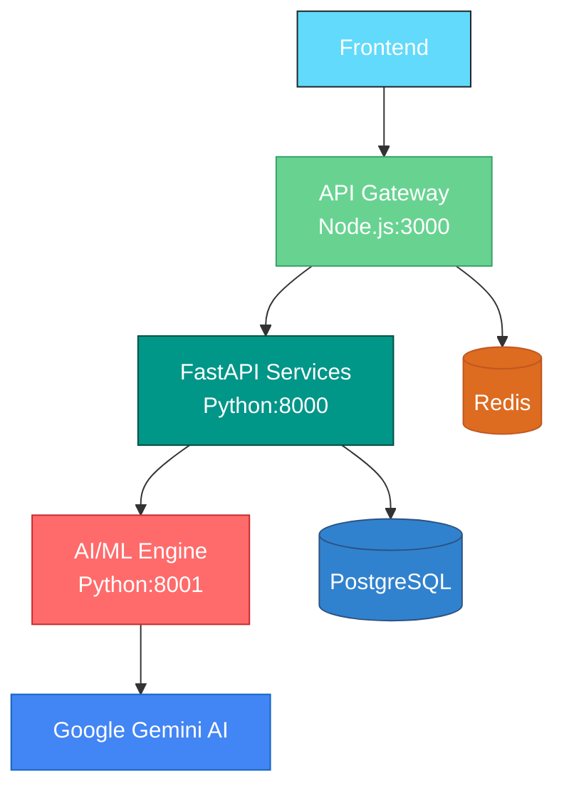

# REGIQ Integration Architecture Summary

## Overview
REGIQ is a three-tier system consisting of:
1. **Frontend**: React Native mobile application
2. **Backend**: Node.js API gateway with FastAPI microservices
3. **AI/ML Engine**: Python-based AI services

## Communication Flow

### Frontend → Backend
- **Protocol**: HTTP/HTTPS RESTful APIs
- **Authentication**: JWT Bearer tokens
- **Data Format**: JSON
- **Base URL**: `http://localhost:3000` (dev) or `https://api.domain.com` (prod)

### Backend → AI/ML Services
- **Protocol**: HTTP/HTTPS RESTful APIs
- **Authentication**: API keys in Authorization headers
- **Data Format**: JSON
- **Internal URL**: `http://fastapi-backend:8000` (Docker) or `http://localhost:8000` (dev)

### Data Storage
- **Primary Database**: PostgreSQL
- **Cache Layer**: Redis
- **File Storage**: Local filesystem/S3 (for documents)

## Service Dependencies



## Key Integration Points

### 1. Authentication Flow
```
Frontend → API Gateway → JWT Validation
API Gateway → FastAPI Services → Bearer Token
FastAPI Services → AI/ML Engine → API Key
```

### 2. Data Flow
```
Frontend Request → API Gateway → FastAPI Service → AI/ML Engine
AI/ML Response → FastAPI Service → API Gateway → Frontend
```

### 3. Database Access
```
API Gateway ↔ PostgreSQL (User data, regulations)
FastAPI Services ↔ PostgreSQL (AI results, analytics)
AI/ML Engine ↔ PostgreSQL (Model data, training sets)
All Services ↔ Redis (Caching, sessions)
```

## Environment Configuration

### Required Variables
- `DATABASE_URL` - PostgreSQL connection string
- `REDIS_URL` - Redis connection string
- `JWT_SECRET` - Secret for JWT token signing
- `GOOGLE_API_KEY` - Google Gemini API key
- `AI_ML_SERVICE_API_KEY` - Internal service authentication

## Deployment Architecture

### Docker Networks
- **regiq-network** - Isolated network for all services
- **External Access** - Only API Gateway port 3000 exposed

### Service Ports
- **API Gateway**: 3000
- **FastAPI Backend**: 8000
- **AI/ML Services**: 8001
- **PostgreSQL**: 5432
- **Redis**: 6379

## Monitoring Endpoints

- **Health Checks**: `/health` on all services
- **API Docs**: `/docs` on API Gateway and FastAPI services
- **Metrics**: `/metrics` (when enabled)

This integration ensures seamless communication between all components while maintaining security and scalability.