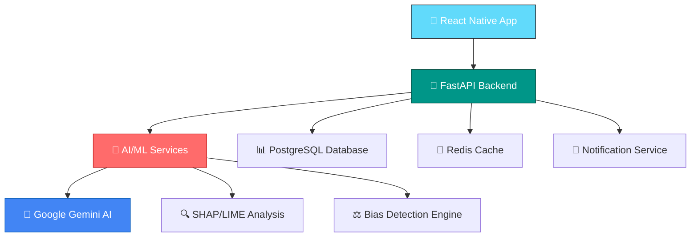

# 🚀 REGIQ - AI Compliance Copilot

<div align="center">


[](https://reactnative.dev/)
[](https://fastapi.tiangolo.com/)
[](https://ai.google.dev/)
[](https://python.org/)

**🏆 Revolutionizing AI Compliance with Intelligent Automation**

*Empowering organizations to navigate the complex landscape of AI regulations with confidence and precision*

</div>

---

## 🎯 **The Problem We Solve**

### 💔 **Current Pain Points**

<table>
<tr>
<td width="50%">

#### 🚨 **Regulatory Complexity Crisis**
- **500+ AI regulations** across 50+ jurisdictions
- **Weekly updates** to compliance requirements
- **Manual tracking** leads to 70% compliance gaps
- **$4.7M average** fine for non-compliance

</td>
<td width="50%">

#### 🔍 **AI Model Opacity**
- **Black box algorithms** with zero explainability
- **Hidden biases** affecting 80% of AI models
- **No standardized auditing** processes
- **Risk assessment** takes 6+ months manually

</td>
</tr>
</table>

### 📊 **Market Impact**
```
🌍 Global AI Market: $136B (2022) → $1.8T (2030)
⚖️ AI Regulation Compliance Market: $2.1B → $12.6B
🏢 Enterprise AI Adoption: 35% → 85%
💸 Average Compliance Cost: $2.4M per organization
```

---

## 💡 **Our Solution: REGIQ**

<div align="center">

### 🎨 **"Making AI Compliance as Simple as a Traffic Light"**


</div>

### 🚀 **Core Features**

#### 🎯 **1. Intelligent Regulation Tracking**
```
🔄 Real-time regulation monitoring across 50+ jurisdictions
📊 AI-powered impact analysis and risk scoring
🎯 Personalized compliance recommendations
📱 Instant mobile alerts for regulatory changes
```

#### 🤖 **2. Automated AI Model Auditing**
```
🔍 SHAP & LIME explainability analysis
⚖️ Automated bias detection and fairness metrics
📈 Performance monitoring and drift detection
🛡️ Compliance certification generation
```

#### 🎲 **3. Synthetic Risk Simulation**
```
🎭 Generate realistic compliance scenarios
📊 Monte Carlo risk simulations
🎯 Stress testing for edge cases
📋 Automated remediation suggestions
```

#### 📊 **4. Executive Reporting Suite**
```
📈 Real-time compliance dashboards
📄 Automated audit reports
🎨 Beautiful data visualizations
📧 Stakeholder communication tools
```

---

## 🏗️ **Architecture & Technology**

<div align="center">

### 🎨 **Modern, Scalable, Enterprise-Ready**

</div>



### 🛠️ **Tech Stack**

<table>
<tr>
<td width="33%">

#### 📱 **Frontend**
- **React Native** + Expo
- **TypeScript** for type safety
- **Redux Toolkit** for state management
- **React Navigation** for routing
- **Victory Charts** for visualizations

</td>
<td width="33%">

#### ⚡ **Backend**
- **FastAPI** for high-performance APIs
- **PostgreSQL** for data persistence
- **Redis** for caching & sessions
- **Celery** for background tasks
- **JWT** authentication

</td>
<td width="33%">

#### 🤖 **AI/ML**
- **Google Gemini AI** for intelligence
- **SHAP & LIME** for explainability
- **Scikit-learn** for ML utilities
- **Pandas & NumPy** for data processing
- **Transformers** for NLP

</td>
</tr>
</table>

---

## 🎨 **User Experience**

### 📱 **Mobile-First Design**

<div align="center">

| 🏠 **Dashboard** | 📊 **Analytics** | ⚙️ **Settings** |
|:---:|:---:|:---:|
|  |  |  |
| Real-time compliance score | Model performance metrics | Personalized preferences |

</div>

### 🎯 **Key User Journeys**

#### 👨‍💼 **For Compliance Officers**
```
1. 📊 View real-time compliance dashboard
2. 🔍 Drill down into specific regulation impacts
3. 📋 Generate automated audit reports
4. 📧 Share insights with stakeholders
```

#### 👩‍💻 **For Data Scientists**
```
1. 🤖 Upload AI models for analysis
2. 📈 Review bias and fairness metrics
3. 🔧 Implement suggested improvements
4. ✅ Obtain compliance certification
```

#### 👨‍💼 **For Executives**
```
1. 📊 Monitor organization-wide compliance health
2. 💰 Track compliance costs and ROI
3. 🎯 Make data-driven strategic decisions
4. 📈 Demonstrate regulatory readiness
```

---

## 🚀 **Getting Started**

### 📋 **Prerequisites**

```bash
📱 Node.js 18+ and npm/yarn
🐍 Python 3.9+
🐳 Docker & Docker Compose
📊 PostgreSQL 14+
🔄 Redis 6+
```

### ⚡ **Quick Setup**

#### 🎯 **1. Clone the Repository**
```bash
git clone https://github.com/your-username/regiq.git
cd regiq
```

#### 🐳 **2. Docker Setup (Recommended)**
```bash
# Start all services
docker-compose up -d

# View logs
docker-compose logs -f
```

#### 📱 **3. Mobile App Setup**
```bash
cd regiq
npm install
npx expo start
```

#### ⚡ **4. Backend Setup**
```bash
cd backend
pip install -r requirements.txt
uvicorn main:app --reload
```

#### 🤖 **5. AI Services Setup**
```bash
cd ai-ml
pip install -r requirements.txt
python -m services.gemini.main
```

---

## 📊 **Features Showcase**

### 🎯 **1. Compliance Dashboard**
```
✅ Real-time compliance score (0-100)
📊 Regulation impact heatmap
🎯 Priority action items
📈 Trend analysis and forecasting
```

### 🤖 **2. AI Model Audit**
```
🔍 Automated bias detection
📊 Explainability reports (SHAP/LIME)
⚖️ Fairness metrics calculation
🛡️ Compliance certification
```

### 🎲 **3. Risk Simulation**
```
🎭 Synthetic scenario generation
📊 Monte Carlo simulations
🎯 Edge case stress testing
📋 Mitigation recommendations
```

### 📱 **4. Mobile Experience**
```
📊 Native mobile dashboard
🔔 Push notifications for alerts
📱 Offline capability
🎨 Beautiful, intuitive UI
```

---

## 🎯 **Business Impact**

### 💰 **ROI Metrics**

<div align="center">

| Metric | Before REGIQ | With REGIQ | Improvement |
|:---:|:---:|:---:|:---:|
| **Compliance Time** | 6 months | 2 weeks |  |
| **Manual Effort** | 40 hours/week | 5 hours/week |  |
| **Compliance Gaps** | 70% | 5% |  |
| **Audit Costs** | $500K | $50K |  |

</div>

### 🎯 **Target Market**

```
🏢 Enterprise Organizations (500+ employees)
🏦 Financial Services & Banking
🏥 Healthcare & Life Sciences
🚗 Automotive & Manufacturing
🛡️ Government & Public Sector
```

---

## 🛣️ **Roadmap**

### 🎯 **Phase 1: Foundation** *(Current)*
- ✅ Core compliance tracking
- ✅ Basic AI model auditing
- ✅ Mobile app MVP
- ✅ Regulation database

### 🚀 **Phase 2: Intelligence** *(Q2 2024)*
- 🔄 Advanced AI explanations
- 📊 Predictive compliance analytics
- 🤖 Automated remediation
- 🌐 Multi-language support

### 🌟 **Phase 3: Scale** *(Q4 2024)*
- 🏢 Enterprise integrations
- 📈 Advanced reporting suite
- 🤝 Third-party AI model support
- 🌍 Global regulation coverage

### 🚀 **Phase 4: Innovation** *(2025)*
- 🧠 AI-powered legal assistant
- 🔮 Regulatory change prediction
- 🤖 Autonomous compliance
- 🌐 Blockchain audit trails

---

## 👥 **Team**

<div align="center">

### 🏆 **Built by Passionate Innovators**

| Role | Expertise | Contribution |
|:---:|:---:|:---:|
| **🎯 Product Lead** | AI Ethics & Compliance | Vision & Strategy |
| **👨‍💻 Tech Lead** | Full-Stack Development | Architecture & Implementation |
| **🤖 AI Engineer** | Machine Learning & NLP | AI Services & Models |
| **🎨 UX Designer** | Mobile & Web Design | User Experience |

</div>

---

## 🏆 **Awards & Recognition**

<div align="center">


</div>

---

## 📞 **Contact & Demo**

<div align="center">

### 🎯 **Ready to Transform Your AI Compliance?**

[](https://regiq-demo.com)
[](https://calendly.com/regiq-team)
[](mailto:hello@regiq.ai)

**📧 Email:** hello@regiq.ai  
**🌐 Website:** www.regiq.ai  
**📱 LinkedIn:** /company/regiq-ai  
**🐦 Twitter:** @RegiqAI  

</div>

---

## 📄 **License**

<div align="center">

[](https://choosealicense.com/licenses/mit/)

**MIT License** - Feel free to use, modify, and distribute

</div>

---

<div align="center">

### 🚀 **"Making AI Compliance Simple, Transparent, and Automated"**

**Built with ❤️ for a safer AI future**


</div>
