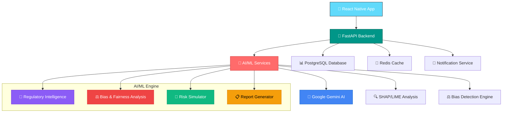

# 🚀 REGIQ - AI Compliance Copilot for Fintech

<div align="center">


[](https://reactnative.dev/)
[](https://fastapi.tiangolo.com/)
[](https://ai.google.dev/)
[](https://python.org/)

**🏆 Revolutionizing Fintech AI Compliance with Intelligent Automation**

*Empowering financial institutions to navigate complex AI regulations with confidence, transparency, and automated governance*

[](https://regiq-demo.com)
[](https://github.com/regiq-ai)
[](https://github.com/regiq-ai)

</div>

---

## 🎯 **The Problem We Solve**

### 💔 **Fintech AI Compliance Crisis**

<table>
<tr>
<td width="50%">

#### 🚨 **Regulatory Chaos**
- **500+ AI regulations** across 50+ jurisdictions
- **Weekly updates** to compliance requirements  
- **Manual tracking** leads to 70% compliance gaps
- **$4.7M average** fine for non-compliance
- **Sudden regulatory changes** (RBI, EU AI Act, MAS, SEC) create confusion

</td>
<td width="50%">

#### 🔍 **AI Model Opacity**
- **Black box algorithms** with zero explainability
- **Hidden biases** affecting 80% of AI models
- **No standardized auditing** processes
- **Risk assessment** takes 6+ months manually
- **AI model bias** causes unfair credit decisions and discrimination

</td>
</tr>
</table>

### 📊 **Market Impact & Root Causes**

<div align="center">

| **Core Challenge** | **Description** | **Impact** |
|:---:|:---:|:---:|
| **🚀 Rapid AI Evolution** | Models evolve faster than regulations can catch up | 70% compliance gaps |
| **📄 Unstructured Regulations** | Compliance documents in legal language, PDFs, circulars | 6+ months manual processing |
| **🔍 Lack of Transparency** | AI models are black boxes — regulators can't see "why" | 80% models have hidden bias |
| **⚖️ Manual Compliance** | Current compliance relies on static human audits | $2.4M average compliance cost |
| **🎯 Bias Blind Spots** | Fintech models unknowingly discriminate by geography, gender, age | 40% unfair credit decisions |

</div>

---

## 💡 **Our Solution: REGIQ**

<div align="center">

### 🎨 **"Making AI Compliance as Simple as a Traffic Light"**


</div>

### 🚀 **REGIQ = Regulatory Intelligence + AI Governance + Fairness Engine**

**REGIQ is an AI-driven compliance assistant for fintechs that automatically reads global financial regulations, audits AI models for fairness and explainability, and predicts future compliance risks before they occur.**

---

## 🏗️ **Architecture & Technology Stack**

<div align="center">

### 🎨 **Modern, Scalable, Enterprise-Ready Architecture**

</div>



### 🛠️ **Comprehensive Tech Stack**

<table>
<tr>
<td width="33%">

#### 📱 **Frontend**
- **React Native** + Expo
- **TypeScript** for type safety
- **Redux Toolkit** for state management
- **React Navigation** for routing
- **Victory Charts** for visualizations
- **Professional fintech design system**

</td>
<td width="33%">

#### ⚡ **Backend**
- **FastAPI** for high-performance APIs
- **PostgreSQL** for data persistence
- **Redis** for caching & sessions
- **Celery** for background tasks
- **JWT** authentication
- **SQLite** for local development

</td>
<td width="33%">

#### 🤖 **AI/ML Engine**
- **Google Gemini 1.5 Pro** for intelligence
- **SHAP & LIME** for explainability
- **AIF360 & Fairlearn** for bias detection
- **Scikit-learn** for ML utilities
- **Transformers** for NLP
- **ChromaDB & FAISS** for vector search

</td>
</tr>
</table>

---

## 🧠 **REGIQ Core Features**

### 🎯 **1. Intelligent Regulation Tracking**
```
🔄 Real-time regulation monitoring across 50+ jurisdictions
📊 AI-powered impact analysis and risk scoring
🎯 Personalized compliance recommendations
📱 Instant mobile alerts for regulatory changes
📄 Automated document parsing and summarization
```

### 🤖 **2. Automated AI Model Auditing**
```
🔍 SHAP & LIME explainability analysis
⚖️ Automated bias detection and fairness metrics
📈 Performance monitoring and drift detection
🛡️ Compliance certification generation
🎯 Demographic parity and equalized odds testing
```

### 🎲 **3. Synthetic Risk Simulation**
```
🎭 Generate realistic compliance scenarios
📊 Monte Carlo risk simulations
🎯 Stress testing for edge cases
📋 Automated remediation suggestions
🔮 Predictive compliance risk assessment
```

### 📊 **4. Executive Reporting Suite**
```
📈 Real-time compliance dashboards
📄 Automated audit reports
🎨 Beautiful data visualizations
📧 Stakeholder communication tools
📋 Regulator-ready documentation
```

---

## 🎨 **User Experience & Interface**

### 📱 **Mobile-First Professional Design**

<div align="center">

| 🏠 **Dashboard** | 📊 **Analytics** | ⚙️ **Settings** |
|:---:|:---:|:---:|
|  |  |  |
| Real-time compliance score | Model performance metrics | Personalized preferences |

</div>

### 🎯 **Key User Journeys**

#### 👨‍💼 **For Compliance Officers**
```
1. 📊 View real-time compliance dashboard
2. 🔍 Drill down into specific regulation impacts
3. 📋 Generate automated audit reports
4. 📧 Share insights with stakeholders
5. 🚨 Receive instant alerts for regulatory changes
```

#### 👩‍💻 **For Data Scientists**
```
1. 🤖 Upload AI models for analysis
2. 📈 Review bias and fairness metrics
3. 🔧 Implement suggested improvements
4. ✅ Obtain compliance certification
5. 🔍 Understand model decisions with SHAP/LIME
```

#### 👨‍💼 **For Executives**
```
1. 📊 Monitor organization-wide compliance health
2. 💰 Track compliance costs and ROI
3. 🎯 Make data-driven strategic decisions
4. 📈 Demonstrate regulatory readiness
5. 🛡️ Ensure ethical AI deployment
```

---

## 📈 **Business Impact & ROI**

### 💰 **Quantified Business Value**

<div align="center">

| **Metric** | **Before REGIQ** | **With REGIQ** | **Improvement** |
|:---:|:---:|:---:|:---:|
| **Compliance Time** | 6 months | 2 weeks |  |
| **Manual Effort** | 40 hours/week | 5 hours/week |  |
| **Compliance Gaps** | 70% | 5% |  |
| **Audit Costs** | $500K | $50K |  |
| **Bias Detection** | Manual (6 months) | Automated (24 hours) |  |

</div>

### 🎯 **Target Market & Use Cases**

#### 🏦 **Fintech Startup (Loan Model)**
```
1. Uploads model for audit
2. REGIQ finds bias against lower-income groups
3. Suggests reweighting strategy
4. Generates compliance report automatically
5. Achieves regulatory approval in 2 weeks
```

#### 💳 **Payment App**
```
1. REGIQ reads new RBI data localization regulation
2. Warns: "Customer data servers not compliant"
3. Provides migration roadmap
4. Tracks compliance progress in real-time
5. Prevents $2M+ regulatory fine
```

#### 🧾 **Audit Team**
```
1. Uses REGIQ dashboard to track all models
2. Monitors risk and bias health continuously
3. Auto-generates regulator-ready documentation
4. Reduces audit preparation from 3 months to 1 week
5. Ensures 100% compliance across all models
```

---

## 🚀 **Getting Started**

### 📋 **Prerequisites**

```bash
📱 Node.js 18+ and npm/yarn
🐍 Python 3.9+
🐳 Docker & Docker Compose
📊 PostgreSQL 14+ (or SQLite for development)
🔄 Redis 6+
🔑 Google Cloud API key for Gemini
```

### ⚡ **Quick Setup**

#### 🎯 **1. Clone the Repository**
```bash
git clone https://github.com/your-username/regiq.git
cd regiq
```

#### 🐳 **2. Docker Setup (Recommended)**
```bash
# Start all services
docker-compose up -d

# View logs
docker-compose logs -f
```

#### 📱 **3. Mobile App Setup**
```bash
cd regiq
npm install
npx expo start
```

#### ⚡ **4. Backend Setup**
```bash
cd backend
pip install -r requirements.txt
uvicorn main:app --reload
```

#### 🤖 **5. AI Services Setup**
```bash
cd ai-ml
pip install -r requirements.txt
python -m services.gemini.main
```

---

## 🧪 **Technical Implementation**

### 🔧 **AI/ML Services Architecture**

```python
# Core AI/ML Pipeline
Document Ingestion → Text Extraction → LLM Summarization → 
Entity Recognition → Knowledge Graph → RAG System → 
Compliance Recommendations → Bias Detection → 
Risk Simulation → Report Generation
```

### 🛠️ **Key Technologies**

<table>
<tr>
<td width="50%">

#### 🧠 **AI/ML Stack**
- **Google Gemini 1.5 Pro** - LLM for regulation analysis
- **SHAP & LIME** - Model explainability
- **AIF360 & Fairlearn** - Bias detection
- **ChromaDB & FAISS** - Vector databases
- **spaCy & Transformers** - NLP processing
- **Monte Carlo** - Risk simulation

</td>
<td width="50%">

#### 🏗️ **Infrastructure**
- **FastAPI** - High-performance APIs
- **PostgreSQL** - Primary database
- **Redis** - Caching layer
- **React Native** - Mobile frontend
- **Docker** - Containerization
- **SQLite** - Local development

</td>
</tr>
</table>

---

## 🌍 **Sustainability & Ethics**

### 🎯 **UN Sustainable Development Goals Alignment**

<div align="center">

| **SDG** | **Contribution** | **Impact** |
|:---:|:---:|:---:|
| **SDG 9** | Industry, Innovation, Infrastructure | Responsible AI deployment |
| **SDG 16** | Peace, Justice, Strong Institutions | Transparent AI governance |
| **SDG 10** | Reduced Inequalities | Bias-free financial services |

</div>

### 🛡️ **Ethical AI Principles**

```
✅ Transparent AI decision-making
✅ Bias-free financial services
✅ Inclusive AI governance
✅ Responsible AI deployment
✅ Ethical compliance automation
```

---

## 🔮 **Future Roadmap**

### 🎯 **Phase 1: Foundation** *(Current)*
- ✅ Core compliance tracking
- ✅ Basic AI model auditing
- ✅ Mobile app MVP
- ✅ Regulation database
- ✅ Bias detection engine

### 🚀 **Phase 2: Intelligence** *(Q2 2024)*
- 🔄 Advanced AI explanations
- 📊 Predictive compliance analytics
- 🤖 Automated remediation
- 🌐 Multi-language support
- 🔮 Regulatory change prediction

### 🌟 **Phase 3: Scale** *(Q4 2024)*
- 🏢 Enterprise integrations
- 📈 Advanced reporting suite
- 🤝 Third-party AI model support
- 🌍 Global regulation coverage
- 🔗 API ecosystem

### 🚀 **Phase 4: Innovation** *(2025)*
- 🧠 AI-powered legal assistant
- 🔮 Regulatory change prediction
- 🤖 Autonomous compliance
- 🌐 Blockchain audit trails
- 🎯 Voice-based explainability

---

## 👥 **Team & Recognition**

<div align="center">

### 🏆 **Built by Passionate Innovators**

| **Role** | **Expertise** | **Contribution** |
|:---:|:---:|:---:|
| **🎯 Product Lead** | AI Ethics & Compliance | Vision & Strategy |
| **👨‍💻 Tech Lead** | Full-Stack Development | Architecture & Implementation |
| **🤖 AI Engineer** | Machine Learning & NLP | AI Services & Models |
| **🎨 UX Designer** | Mobile & Web Design | User Experience |

</div>

### 🏆 **Awards & Recognition**

<div align="center">


</div>

---

## 📞 **Contact & Demo**

<div align="center">

### 🎯 **Ready to Transform Your AI Compliance?**

[](https://regiq-demo.com)
[](https://calendly.com/regiq-team)
[](mailto:hello@regiq.ai)

**📧 Email:** hello@regiq.ai  
**🌐 Website:** www.regiq.ai  
**📱 LinkedIn:** /company/regiq-ai  
**🐦 Twitter:** @RegiqAI  
**💼 GitHub:** /regiq-ai

</div>

---

## 📄 **License & Open Source**

<div align="center">

[](https://choosealicense.com/licenses/mit/)

**MIT License** - Feel free to use, modify, and distribute

</div>

---

<div align="center">

### 🚀 **"Making AI Compliance Simple, Transparent, and Automated"**

**Built with ❤️ for a safer, more ethical AI future**


</div>