# 🚀 REGIQ - AI Compliance Copilot for Fintech

<div align="center">


[](https://reactnative.dev/)
[](https://fastapi.tiangolo.com/)
[](https://ai.google.dev/)
[](https://python.org/)

**🏆 Revolutionizing Fintech AI Compliance with Intelligent Automation**

*Empowering financial institutions to navigate complex AI regulations with confidence, transparency, and automated governance*

[](https://regiq-demo.com)
[](https://github.com/regiq-ai)

</div>

---

## 🎯 **The Problem We Solve**

### 💔 **Fintech AI Compliance Crisis**

<div align="center">

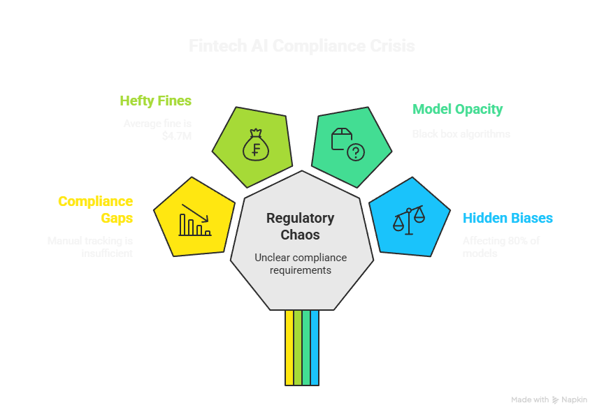

</div>

### 📊 **Market Impact & Root Causes**

<div align="center">


</div>

---

## 💡 **Our Solution: REGIQ**

<div align="center">

### 🎨 **"Making AI Compliance as Simple as a Traffic Light"**


</div>

### 🚀 **REGIQ = Regulatory Intelligence + AI Governance + Fairness Engine**

**REGIQ is an AI-driven compliance assistant for fintechs that automatically reads global financial regulations, audits AI models for fairness and explainability, and predicts future compliance risks before they occur.**

## 🧠 **REGIQ Core Features**

<div align="center">

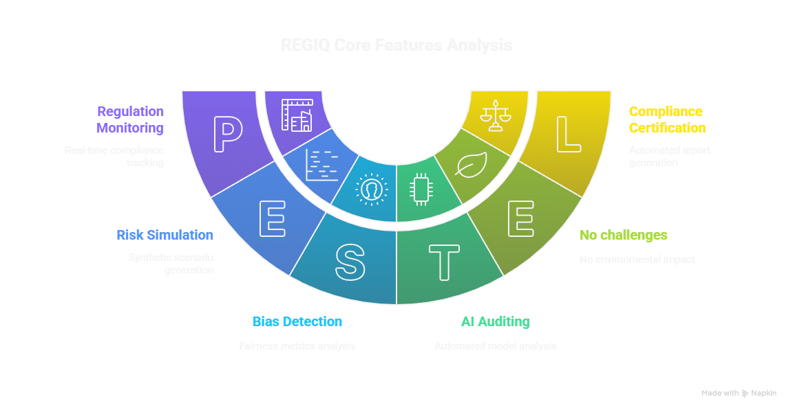

</div>

---

## 📊 **Technical Feasibility**

<div align="center">

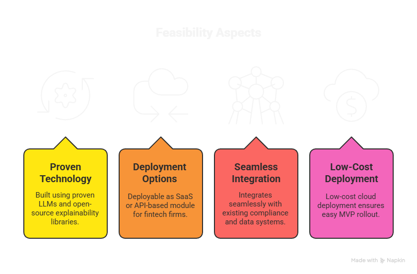

</div>

---

## 🚀 **Innovation Highlights**

<div align="center">

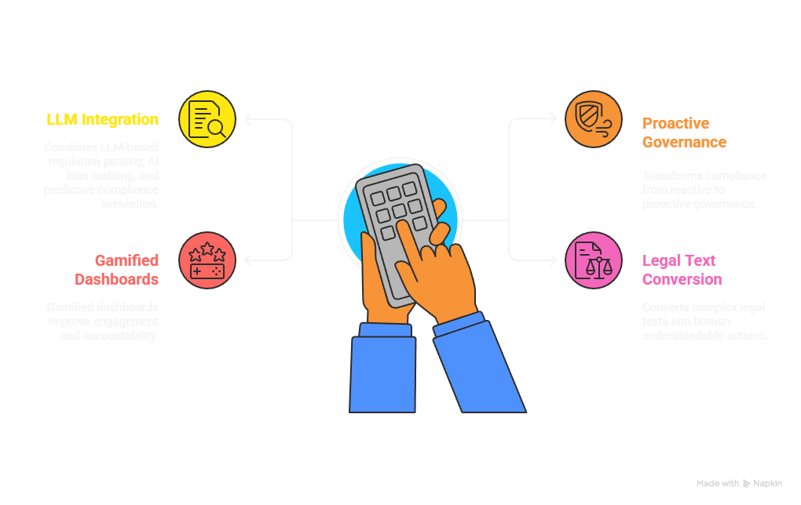

</div>

---

## 📈 **Scalability Features**

<div align="center">

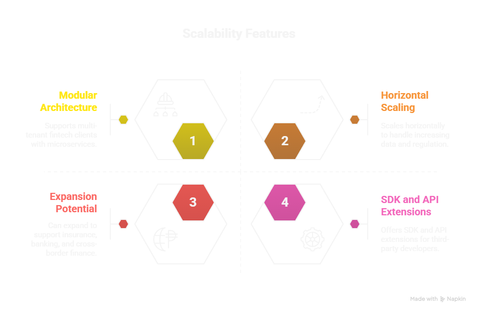

</div>

---

## 🎯 **SWOT Analysis**

<div align="center">

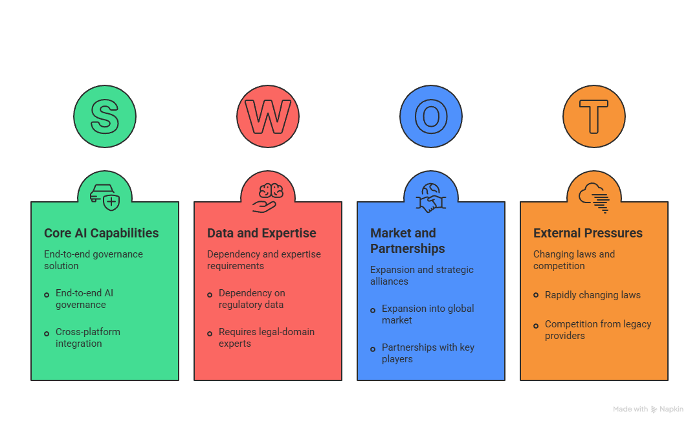

</div>

---

## 🏗️ **Architecture & Technology Stack**

<div align="center">

### 🎨 **Modern, Scalable, Enterprise-Ready Architecture**

</div>

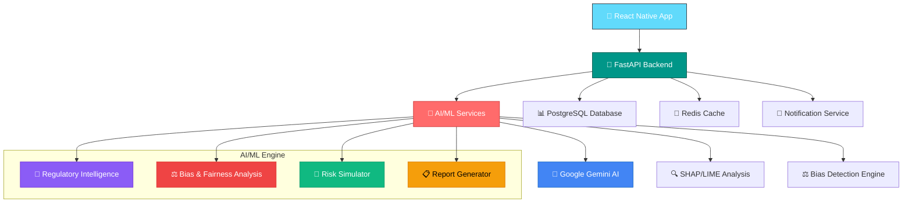

### 🛠️ **Comprehensive Tech Stack**

<table>
<tr>
<td width="33%">

#### 📱 **Frontend**
- **React Native** + Expo
- **TypeScript** for type safety
- **Redux Toolkit** for state management
- **React Navigation** for routing
- **Victory Charts** for visualizations
- **Professional fintech design system**

</td>
<td width="33%">

#### ⚡ **Backend**
- **FastAPI** for high-performance APIs
- **PostgreSQL** for data persistence
- **Redis** for caching & sessions
- **Celery** for background tasks
- **JWT** authentication
- **SQLite** for local development

</td>
<td width="33%">

#### 🤖 **AI/ML Engine**
- **Google Gemini 1.5 Pro** for intelligence
- **SHAP & LIME** for explainability
- **AIF360 & Fairlearn** for bias detection
- **Scikit-learn** for ML utilities
- **Transformers** for NLP
- **ChromaDB & FAISS** for vector search

</td>
</tr>
</table>

---


## 🎨 **User Experience & Interface**

<div align="center">

### 📱 **Intuitive Mobile-First Design**


**Real-time insights • One-click reports • Instant notifications**

</div>

### 🎯 **Built for Every User**

<div align="center">

| 👨‍💼 **Compliance Officers** | 👩‍💻 **Data Scientists** | 👨‍💼 **Executives** |
|:---:|:---:|:---:|
| **Real-time dashboards** | **AI model auditing** | **Strategic insights** |
| **Automated reports** | **Bias detection** | **ROI tracking** |
| **Regulatory alerts** | **Explainability tools** | **Risk monitoring** |

</div>

---

## 📈 **Business Impact & ROI**

### 💰 **Quantified Business Value**

<div align="center">

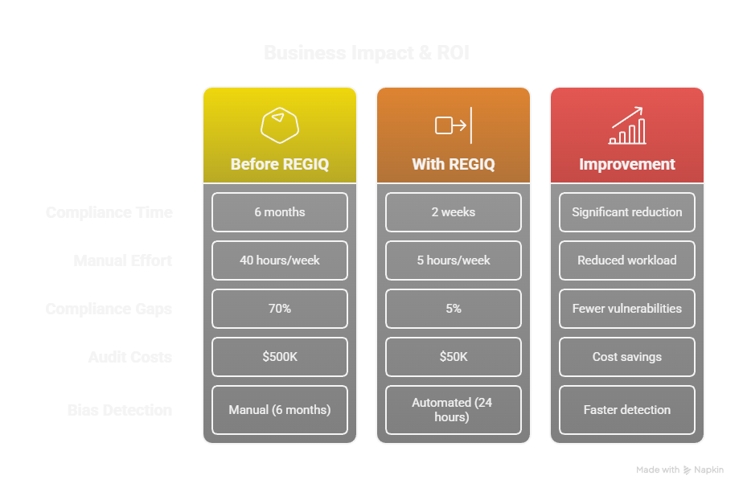

</div>

### 🎯 **Target Market & Use Cases**

<div align="center">

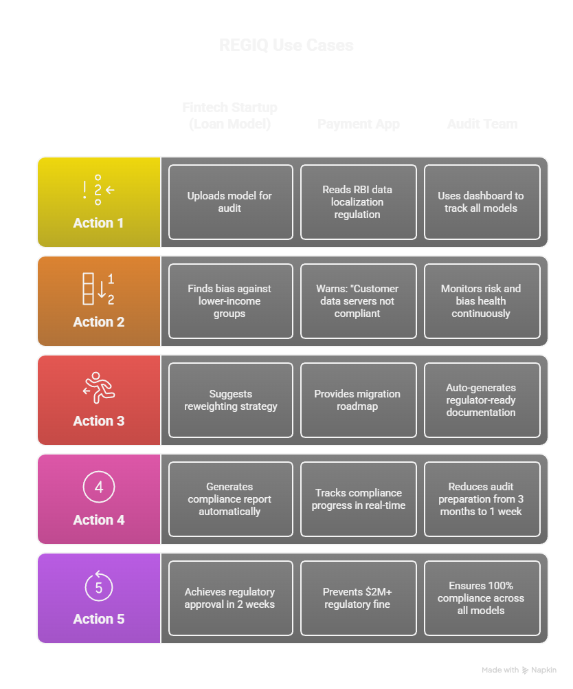

</div>

---

## 🚀 **Getting Started**

### 📋 **Prerequisites**

- Node.js 18+ and npm/yarn
- Python 3.9+
- Docker & Docker Compose
- PostgreSQL 14+ (or SQLite for development)
- Redis 6+
🔑 Google Cloud API key for Gemini

### ⚡ **Quick Setup**

#### 🎯 **1. Clone the Repository**
```bash
git clone https://github.com/your-username/regiq.git
cd regiq
```

#### 🐳 **2. Docker Setup (Recommended)**
```bash
# Start all services
docker-compose up -d

# View logs
docker-compose logs -f
```

#### 📱 **3. Mobile App Setup**
```bash
cd regiq
npm install
npx expo start
```

#### ⚡ **4. Backend Setup**
```bash
cd backend
pip install -r requirements.txt
uvicorn main:app --reload
```

#### 🤖 **5. AI Services Setup**
```bash
cd ai-ml
pip install -r requirements.txt
python -m services.gemini.main
```

---

## 🧪 **Technical Implementation**

### 🔧 **AI/ML Services Architecture**

<div align="center">

#### 🔄 **Core AI/ML Pipeline Flow**

</div>

```mermaid
graph LR
    A[Document Ingestion] --> B[Text Extraction]
    B --> C[LLM Summarization]
    C --> D[Entity Recognition]
    D --> E[Knowledge Graph]
    E --> F[RAG System]
    F --> G[Compliance Recommendations]
    G --> H[Bias Detection]
    H --> I[Risk Simulation]
    I --> J[Report Generation]
    
    style A fill:#4F46E5,stroke:#312E81,color:#fff
    style B fill:#7C3AED,stroke:#4C1D95,color:#fff
    style C fill:#F59E0B,stroke:#92400E,color:#000
    style D fill:#10B981,stroke:#065F46,color:#fff
    style E fill:#8B5CF6,stroke:#5B21B6,color:#fff
    style F fill:#0EA5E9,stroke:#0891B2,color:#fff
    style G fill:#EC4899,stroke:#BE185D,color:#fff
    style H fill:#EF4444,stroke:#B91C1C,color:#fff
    style I fill:#10B981,stroke:#065F46,color:#fff
    style J fill:#F59E0B,stroke:#92400E,color:#000
```

<div align="center">

#### ⚙️ **Pipeline Component Details**

</div>

```
# Core AI/ML Pipeline
Document Ingestion → Text Extraction → LLM Summarization → 
Entity Recognition → Knowledge Graph → RAG System → 
Compliance Recommendations → Bias Detection → 
Risk Simulation → Report Generation
```

### 🛠️ **Key Technologies**

<table>
<tr>
<td width="50%">

#### 🧠 **AI/ML Stack**
- **Google Gemini 1.5 Pro** - LLM for regulation analysis
- **SHAP & LIME** - Model explainability
- **AIF360 & Fairlearn** - Bias detection
- **ChromaDB & FAISS** - Vector databases
- **spaCy & Transformers** - NLP processing
- **Monte Carlo** - Risk simulation

</td>
<td width="50%">

#### 🏗️ **Infrastructure**
- **FastAPI** - High-performance APIs
- **PostgreSQL** - Primary database
- **Redis** - Caching layer
- **React Native** - Mobile frontend
- **Docker** - Containerization
- **SQLite** - Local development

</td>
</tr>
</table>

---

## 🌍 **Sustainability & Ethics**

### 🎯 **UN Sustainable Development Goals Alignment**

<div align="center">

| **SDG** | **Contribution** | **Impact** |
|:---:|:---:|:---:|
| **SDG 9** | Industry, Innovation, Infrastructure | Responsible AI deployment |
| **SDG 16** | Peace, Justice, Strong Institutions | Transparent AI governance |
| **SDG 10** | Reduced Inequalities | Bias-free financial services |

</div>

### 🛡️ **Ethical AI Principles**

```
✅ Transparent AI decision-making
✅ Bias-free financial services
✅ Inclusive AI governance
✅ Responsible AI deployment
✅ Ethical compliance automation
```

---

## 🔮 **Future Roadmap**

<div align="center">

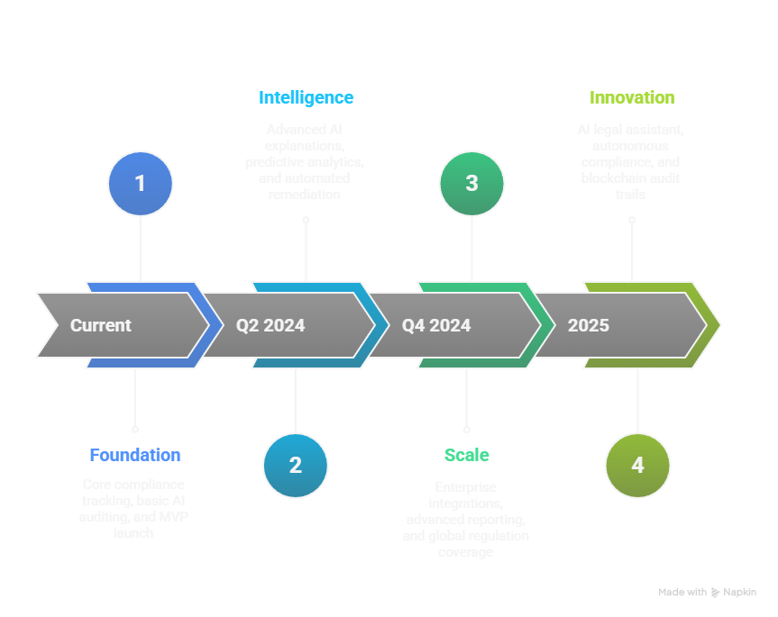

</div>

---

## 👥 **Team & Recognition**

<div align="center">

### 🏆 **Built by Passionate Innovators**

| **Role** | **Expertise** | **Contribution** |
|:---:|:---:|:---:|
| **🎯 Product Lead** | AI Ethics & Compliance | Vision & Strategy |
| **👨‍💻 Tech Lead** | Full-Stack Development | Architecture & Implementation |
| **🤖 AI Engineer** | Machine Learning & NLP | AI Services & Models |
| **🎨 UX Designer** | Mobile & Web Design | User Experience |

</div>


---

<div align="center">

### 🚀 **"Making AI Compliance Simple, Transparent, and Automated"**

**Built with ❤️ for a safer, more ethical AI future**


</div>