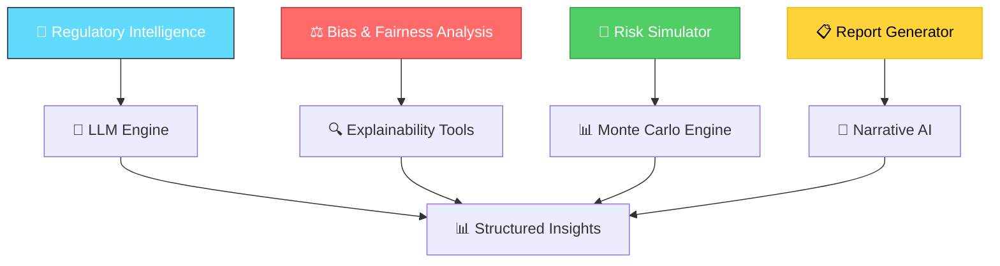
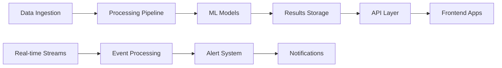

# 🤖 REGIQ AI/ML Engine

<div align="center">

**AI-Powered Compliance Intelligence & Risk Assessment Platform**

[](https://python.org)
[](https://tensorflow.org)
[](https://pytorch.org)
[](https://huggingface.co)

</div>

---

## 🎯 **Overview**

The REGIQ AI/ML Engine is the intelligent core of our compliance platform, providing automated regulatory analysis, bias detection, risk simulation, and explainable AI capabilities for fintech organizations.

### 🏗️ **Architecture Components**



---

## 🔹 **A. Regulatory Intelligence Engine**

### 🎯 **Purpose**
Parse, summarize, and interpret complex regulatory documents using advanced NLP and LLM technologies.

### 🔄 **Pipeline Architecture**
```python
# Processing Flow
Document Ingestion → Text Extraction → LLM Summarization → 
Entity Recognition → Knowledge Graph → RAG System → 
Compliance Recommendations
```

### 🛠️ **Core Technologies**
- **LLM Models**: Google Gemini 1.5 Pro, GPT-4-turbo, Llama 3
- **NLP Framework**: spaCy, Hugging Face Transformers
- **Document Processing**: LangChain, LlamaIndex
- **Knowledge Retrieval**: RAG (Retrieval-Augmented Generation)

### 📊 **Key Features**
- **Multi-format Support**: PDFs, APIs, web scraping
- **Smart Summarization**: Context-aware regulatory summaries
- **Entity Extraction**: Deadlines, requirements, penalties
- **Compliance Mapping**: User-specific recommendations
- **Real-time Updates**: Automated regulatory monitoring

### 🔧 **Implementation Structure**
```
regulatory_intelligence/
├── scrapers/
│   ├── pdf_processor.py
│   ├── api_connectors.py
│   └── web_scrapers.py
├── nlp/
│   ├── summarizer.py
│   ├── entity_extractor.py
│   └── compliance_mapper.py
├── llm/
│   ├── gemini_client.py
│   ├── openai_client.py
│   └── llama_client.py
└── rag/
    ├── vector_store.py
    ├── retriever.py
    └── generator.py
```

---

## ⚖️ **B. Bias & Fairness Analysis**

### 🎯 **Purpose**
Comprehensive evaluation of fintech AI models for ethical risks, fairness violations, and regulatory compliance.

### 🔄 **Analysis Pipeline**
```python
# Bias Detection Flow
Model Upload → Dataset Analysis → Fairness Metrics → 
Explainability Analysis → Bias Scoring → 
Remediation Recommendations
```

### 📈 **Fairness Metrics**
- **Demographic Parity**: Equal positive prediction rates across groups
- **Equalized Odds**: Equal TPR and FPR across protected attributes
- **Calibration**: Prediction probabilities reflect true outcomes
- **Individual Fairness**: Similar individuals receive similar predictions

### 🛠️ **Core Tools**
- **Fairness Libraries**: Fairlearn, AIF360
- **Explainability**: SHAP, LIME, Integrated Gradients
- **Model Support**: scikit-learn, XGBoost, PyTorch, TensorFlow
- **Visualization**: Plotly, Matplotlib, Seaborn

### 📊 **Output Example**
```json
{
  "model_id": "credit_risk_v2",
  "bias_score": 0.82,
  "overall_fairness": "MODERATE_RISK",
  "flagged_attributes": ["gender", "region"],
  "top_features": ["income", "credit_history", "employment_length"],
  "fairness_metrics": {
    "demographic_parity": 0.15,
    "equalized_odds": 0.08,
    "calibration_error": 0.03
  },
  "recommendations": [
    "Retrain model excluding region as a predictor",
    "Apply post-processing bias mitigation",
    "Increase training data diversity"
  ],
  "compliance_status": {
    "gdpr": "COMPLIANT",
    "eu_ai_act": "NEEDS_REVIEW",
    "fair_credit": "COMPLIANT"
  }
}
```

### 🔧 **Implementation Structure**
```
bias_analysis/
├── metrics/
│   ├── fairness_calculator.py
│   ├── demographic_parity.py
│   └── equalized_odds.py
├── explainability/
│   ├── shap_analyzer.py
│   ├── lime_explainer.py
│   └── feature_importance.py
├── mitigation/
│   ├── preprocessing.py
│   ├── inprocessing.py
│   └── postprocessing.py
└── visualization/
    ├── bias_dashboard.py
    ├── fairness_plots.py
    └── explanation_charts.py
```

---

## 🎲 **C. Synthetic Risk Simulator**

### 🎯 **Purpose**
Predictive modeling for regulatory compliance risks using advanced simulation techniques and probabilistic inference.

### 🔄 **Simulation Pipeline**
```python
# Risk Prediction Flow
Regulation Input → Model Analysis → Risk Modeling → 
Monte Carlo Simulation → Probability Distribution → 
Impact Assessment → Mitigation Strategies
```

### 🧮 **Simulation Methods**
- **Monte Carlo Simulation**: Risk probability distributions
- **Bayesian Inference**: Uncertainty quantification
- **Scenario Analysis**: What-if regulatory changes
- **Stress Testing**: Extreme compliance scenarios

### 🛠️ **Core Technologies**
- **Probabilistic Programming**: PyMC3, Stan
- **Time Series**: Prophet, ARIMA
- **Numerical Computing**: NumPy, SciPy
- **Visualization**: Bokeh, Plotly, D3.js

### 📊 **Output Example**
```json
{
  "simulation_id": "RISK_SIM_203",
  "timestamp": "2024-01-15T10:30:00Z",
  "regulation_context": {
    "name": "EU AI Act - Article 13",
    "effective_date": "2025-08-02",
    "risk_category": "HIGH_RISK_AI_SYSTEM"
  },
  "risk_assessment": {
    "predicted_noncompliance_probability": 0.68,
    "confidence_interval": [0.52, 0.84],
    "risk_level": "HIGH"
  },
  "affected_models": [
    {
      "model_id": "loan_approval_v3",
      "impact_score": 0.85,
      "compliance_gap": "transparency_requirements"
    }
  ],
  "financial_impact": {
    "potential_fine_range": [50000, 500000],
    "remediation_cost": 75000,
    "business_disruption_days": 14
  },
  "recommendations": [
    "Enhance model transparency reports",
    "Implement automated bias monitoring",
    "Add feature importance explanations",
    "Create audit trail documentation"
  ],
  "mitigation_timeline": {
    "immediate": ["Document current processes"],
    "short_term": ["Implement monitoring"],
    "long_term": ["Model retraining"]
  }
}
```

### 🔧 **Implementation Structure**
```
risk_simulator/
├── models/
│   ├── monte_carlo.py
│   ├── bayesian_inference.py
│   └── scenario_generator.py
├── regulations/
│   ├── eu_ai_act.py
│   ├── gdpr_compliance.py
│   └── financial_regulations.py
├── simulation/
│   ├── risk_calculator.py
│   ├── impact_assessor.py
│   └── timeline_predictor.py
└── visualization/
    ├── risk_heatmap.py
    ├── probability_charts.py
    └── impact_dashboard.py
```

---

## 📋 **D. Explainability & Report Generation**

### 🎯 **Purpose**
Transform complex AI model decisions into human-readable, regulator-friendly explanations and comprehensive reports.

### 🔄 **Generation Pipeline**
```python
# Report Generation Flow
Model Analysis → Feature Attribution → Narrative Generation → 
Visual Dashboard → PDF Compilation → Regulatory Formatting
```

### 📝 **Report Types**
- **Model Audit Reports**: Comprehensive model analysis
- **Bias Assessment Reports**: Fairness evaluation summaries
- **Compliance Reports**: Regulatory requirement mapping
- **Risk Assessment Reports**: Predictive compliance analysis
- **Executive Summaries**: High-level stakeholder briefings

### 🛠️ **Core Technologies**
- **Explainability**: SHAP, LIME, Integrated Gradients
- **Narrative AI**: GPT-4-turbo, Gemini Pro
- **Report Generation**: ReportLab, WeasyPrint
- **Data Processing**: Pandas, NumPy
- **Visualization**: Matplotlib, Plotly, Seaborn

### 📊 **Report Components**
```python
# Report Structure
{
  "executive_summary": "AI-generated overview",
  "model_performance": {
    "accuracy_metrics": {...},
    "fairness_scores": {...},
    "explainability_index": 0.87
  },
  "regulatory_compliance": {
    "gdpr_status": "COMPLIANT",
    "ai_act_readiness": "PARTIAL",
    "gaps_identified": [...]
  },
  "recommendations": {
    "immediate_actions": [...],
    "strategic_improvements": [...],
    "timeline": "Q2 2024"
  },
  "technical_appendix": {
    "methodology": "...",
    "data_sources": [...],
    "model_details": {...}
  }
}
```

### 🔧 **Implementation Structure**
```
report_generator/
├── explainers/
│   ├── shap_explainer.py
│   ├── lime_explainer.py
│   └── feature_analyzer.py
├── narrative/
│   ├── llm_narrator.py
│   ├── template_engine.py
│   └── content_formatter.py
├── visualization/
│   ├── chart_generator.py
│   ├── dashboard_builder.py
│   └── plot_templates.py
└── output/
    ├── pdf_generator.py
    ├── html_exporter.py
    └── json_formatter.py
```

---

## 🗄️ **Data Architecture**

### 📊 **Storage Strategy**

| **Data Type** | **Storage** | **Description** | **Volume** |
|---------------|-------------|-----------------|------------|
| **User & Auth Data** | PostgreSQL | Credentials, roles, permissions | ~10K users |
| **Regulations & Alerts** | MongoDB | Parsed laws, metadata, deadlines | ~100GB |
| **AI Models & Datasets** | S3/GCS | Model files, training data | ~1TB |
| **Bias Reports** | PostgreSQL | Audit outcomes, fairness metrics | ~50GB |
| **Risk Simulations** | MongoDB | Simulation results, projections | ~200GB |
| **Logs & Analytics** | ElasticSearch | User actions, API logs, metrics | ~500GB |

### 🔄 **Data Flow Architecture**


---

## 🚀 **Getting Started**

### 📋 **Prerequisites**
```bash
# Python Environment
Python 3.9+
CUDA 11.8+ (for GPU acceleration)
Docker & Docker Compose
```

### 📦 **Installation**
```bash
# Clone repository
git clone https://github.com/your-org/regiq-ai-ml.git
cd regiq-ai-ml

# Create virtual environment
python -m venv venv
source venv/bin/activate  # Linux/Mac
# or
venv\Scripts\activate     # Windows

# Install dependencies
pip install -r requirements.txt

# Install development dependencies
pip install -r requirements-dev.txt

# Setup environment variables
cp .env.example .env
# Edit .env with your API keys and configurations
```

### 🔧 **Configuration**
```bash
# Initialize configuration
python scripts/setup_config.py

# Download pre-trained models
python scripts/download_models.py

# Setup databases
docker-compose up -d postgres mongodb elasticsearch

# Run migrations
python scripts/migrate_db.py
```

### 🏃 **Quick Start**
```bash
# Start all services
docker-compose up -d

# Run regulatory intelligence
python -m services.regulatory_intelligence.main

# Run bias analysis
python -m services.bias_analysis.main

# Run risk simulator
python -m services.risk_simulator.main

# Generate reports
python -m services.report_generator.main
```

---

## 📁 **Project Structure**

```
ai-ml/
├── 📁 config/                    # Configuration files
│   ├── models.yaml              # Model configurations
│   ├── databases.yaml           # Database settings
│   └── api_keys.yaml           # API credentials
├── 📁 data/                     # Data storage
│   ├── raw/                    # Raw regulatory documents
│   ├── processed/              # Cleaned datasets
│   └── models/                 # Trained model files
├── 📁 services/                 # Core AI/ML services
│   ├── regulatory_intelligence/ # Regulatory analysis
│   ├── bias_analysis/          # Fairness evaluation
│   ├── risk_simulator/         # Risk prediction
│   └── report_generator/       # Report creation
├── 📁 models/                   # ML model implementations
│   ├── nlp/                    # NLP models
│   ├── fairness/               # Bias detection models
│   └── simulation/             # Risk models
├── 📁 notebooks/                # Jupyter notebooks
│   ├── exploratory/            # Data exploration
│   ├── experiments/            # Model experiments
│   └── demos/                  # Feature demonstrations
├── 📁 tests/                    # Test suites
│   ├── unit/                   # Unit tests
│   ├── integration/            # Integration tests
│   └── performance/            # Performance tests
├── 📁 scripts/                  # Utility scripts
│   ├── data_pipeline/          # Data processing
│   ├── model_training/         # Training scripts
│   └── deployment/             # Deployment tools
├── 📁 docs/                     # Documentation
│   ├── api/                    # API documentation
│   ├── models/                 # Model documentation
│   └── tutorials/              # Usage tutorials
├── requirements.txt             # Python dependencies
├── requirements-dev.txt         # Development dependencies
├── docker-compose.yml          # Docker services
├── Dockerfile                  # Container definition
└── README.md                   # This file
```

---

## 🔑 **API Endpoints**

### 🌐 **Core Services**

#### **Regulatory Intelligence**
```http
POST /api/v1/regulatory/analyze
POST /api/v1/regulatory/summarize
GET  /api/v1/regulatory/compliance/{user_id}
```

#### **Bias Analysis**
```http
POST /api/v1/bias/analyze
GET  /api/v1/bias/report/{model_id}
POST /api/v1/bias/mitigation
```

#### **Risk Simulation**
```http
POST /api/v1/risk/simulate
GET  /api/v1/risk/scenarios
POST /api/v1/risk/stress-test
```

#### **Report Generation**
```http
POST /api/v1/reports/generate
GET  /api/v1/reports/{report_id}
POST /api/v1/reports/schedule
```

---

## 🧪 **Testing & Validation**

### 🔬 **Test Coverage**
```bash
# Run all tests
pytest tests/ --cov=services --cov-report=html

# Run specific test suites
pytest tests/unit/
pytest tests/integration/
pytest tests/performance/

# Generate coverage report
coverage report -m
```

### 📊 **Performance Benchmarks**
- **Regulatory Analysis**: <2s per document
- **Bias Detection**: <30s per model
- **Risk Simulation**: <60s per scenario
- **Report Generation**: <10s per report

---

## 🚀 **Deployment**

### 🐳 **Docker Deployment**
```bash
# Build images
docker-compose build

# Deploy to production
docker-compose -f docker-compose.prod.yml up -d

# Scale services
docker-compose up --scale bias-analysis=3
```

### ☁️ **Cloud Deployment**
```bash
# AWS ECS
aws ecs create-cluster --cluster-name regiq-ai-ml

# Google Cloud Run
gcloud run deploy regiq-ai-ml --source .

# Azure Container Instances
az container create --resource-group regiq --name ai-ml
```

---

## 📈 **Monitoring & Observability**

### 📊 **Metrics & Logging**
- **Application Metrics**: Prometheus + Grafana
- **Model Performance**: MLflow + Weights & Biases
- **Error Tracking**: Sentry
- **Log Aggregation**: ELK Stack

### 🚨 **Alerting**
- **Model Drift Detection**: Automated alerts
- **Performance Degradation**: Real-time monitoring
- **Compliance Violations**: Immediate notifications
- **System Health**: Infrastructure monitoring

---

## 🤝 **Contributing**

### 📋 **Development Workflow**
1. **Fork** the repository
2. **Create** feature branch (`git checkout -b feature/amazing-feature`)
3. **Commit** changes (`git commit -m 'Add amazing feature'`)
4. **Push** to branch (`git push origin feature/amazing-feature`)
5. **Open** Pull Request

### 📝 **Code Standards**
- **Python**: PEP 8, Black formatting
- **Documentation**: Google-style docstrings
- **Testing**: Minimum 80% coverage
- **Type Hints**: Required for all functions

---

## 📚 **Resources & Documentation**

### 📖 **Additional Documentation**
- [API Reference](./docs/api/README.md)
- [Model Documentation](./docs/models/README.md)
- [Deployment Guide](./docs/deployment/README.md)
- [Troubleshooting](./docs/troubleshooting/README.md)

### 🔗 **External Resources**
- [Fairlearn Documentation](https://fairlearn.org/)
- [SHAP Documentation](https://shap.readthedocs.io/)
- [LangChain Documentation](https://python.langchain.com/)
- [Hugging Face Transformers](https://huggingface.co/transformers/)

---

## 📄 **License**

This project is licensed under the MIT License - see the [LICENSE](LICENSE) file for details.

---

## 👥 **Team & Support**

### 🏢 **Core Team**
- **AI/ML Lead**: [Your Name]
- **Data Scientists**: [Team Members]
- **ML Engineers**: [Team Members]
- **DevOps**: [Team Members]

### 📞 **Support**
- **Email**: ai-ml-support@regiq.com
- **Slack**: #regiq-ai-ml
- **Issues**: [GitHub Issues](https://github.com/your-org/regiq-ai-ml/issues)

---

<div align="center">

**Built with ❤️ by the REGIQ AI/ML Team**

*Empowering Ethical AI in Financial Services*

</div>
